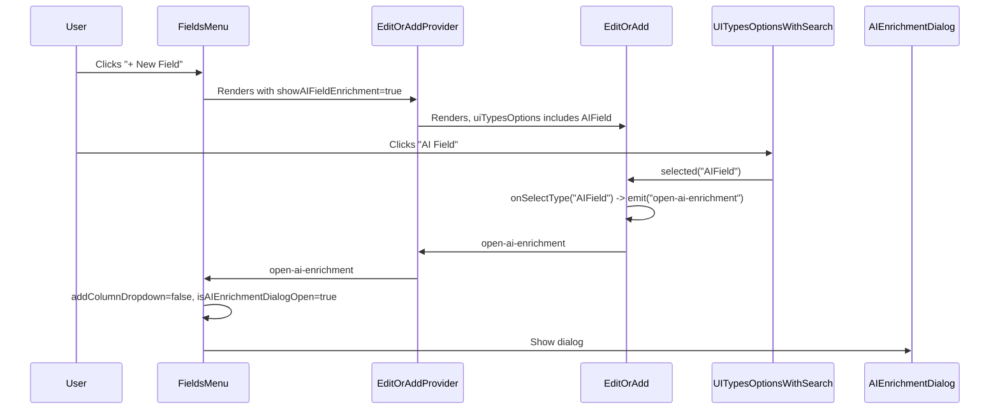

# Add "AI Field" to New Field column-type dropdown

## Current behavior

- **Fields Menu** ([FieldsMenu.vue](packages/nc-gui/components/smartsheet/toolbar/FieldsMenu.vue)) has a standalone **AI** button ([AIFieldButton.vue](packages/nc-gui/components/smartsheet/toolbar/AIFieldButton.vue)) that opens the **AI Enrichment** dialog (bulk add columns with prompt and `meta.isAIField`).
- Clicking **"+ New Field"** opens a dropdown that uses [EditOrAddProvider.vue](packages/nc-gui/components/smartsheet/column/EditOrAddProvider.vue) / [EditOrAdd.vue](packages/nc-gui/components/smartsheet/column/EditOrAdd.vue), which shows a list of column types from [columnUtils.ts](packages/nc-gui/utils/columnUtils.ts) `uiTypes` (e.g. Links, Lookup, Single line text, …). Display names come from **nocodb-sdk** [UITypes.ts](packages/nocodb-sdk/src/lib/UITypes.ts) (`UITypesName`, `UITypesSearchTerms`). The list is rendered by [UITypesOptionsWithSearch.vue](packages/nc-gui/components/smartsheet/column/UITypesOptionsWithSearch.vue).

## Target behavior

- Remove the separate AI button from the Fields Menu.
- Add an **"AI Field"** option to the same column-type list shown when the user clicks **"+ New Field"**.
- When the user selects **"AI Field"**, close the New Field dropdown and open the existing **AI Enrichment** dialog (same as the current button).

No DB or backend changes are needed: the enrichment dialog already uses the existing bulk column API and `meta.isAIField`.

---

## Implementation

### 1. SDK: display name and search for "AI Field"

**File:** [packages/nocodb-sdk/src/lib/UITypes.ts](packages/nocodb-sdk/src/lib/UITypes.ts)

- In `UITypesName`, add: `AIField: 'AI Field'`.
- In `UITypesSearchTerms`, add: `AIField: ['AI Field', 'AI enrichment', 'AI columns']` (or similar) so the type is searchable.

`AIField` is a UI-only “type” (like `AIButton` and `AIPrompt`), not a new enum value in `UITypes`.

### 2. GUI: add AIField to the column-type list

**File:** [packages/nc-gui/utils/columnUtils.ts](packages/nc-gui/utils/columnUtils.ts)

- Export a constant: `export const AIField = 'AIField'`.
- In the `uiTypes` array, add an entry for **AI Field** near the other AI types (e.g. after `AIPrompt`), e.g.:
  - `name: AIField`
  - `icon: iconMap.cellAi` (or `cellAiButton`; consistent with existing AI types)
  - `virtual: 1`, `isNew: 1`, `deprecated: 0` as needed for styling/behavior.
- Ensure `AIField` is included in any exports/lists that other code expects for “all virtual/special types” (e.g. form-view hidden types) only if desired; otherwise keep it out of those so it’s only an add-column option.

### 3. Show "AI Field" only from Fields Menu (recommended)

So “AI Field” only appears when adding a field from the Fields Menu, not from the grid header or other add-column UIs:

- **EditOrAddProvider.vue**: Add an optional prop, e.g. `showAIFieldEnrichment?: boolean`, and pass it through to **EditOrAdd** (or inject/provide it so EditOrAdd can read it).
- **EditOrAdd.vue**:
  - In `uiFilters`, include the `AIField` type only when `showAIFieldEnrichment` is true (same pattern as `showAiFields` for AIPrompt/AIButton).
  - In `onSelectType`, when the selected type is `AIField`: **emit a new event** (e.g. `open-ai-enrichment`) and return without changing `formState` or opening the normal column form. Other types continue to work as today.
  - Add `open-ai-enrichment` to `defineEmits`.
- **EditOrAddProvider.vue**: Re-emit `open-ai-enrichment` from the child so the parent can listen.

**FieldsMenu.vue**:

- Use the provider with `show-aifield-enrichment` (or the chosen prop name) set to `true`.
- Listen for `@open-ai-enrichment`: set `addColumnDropdown = false` and `isAIEnrichmentDialogOpen = true`.
- Remove the **SmartsheetToolbarAIFieldButton** usage and its click handler wiring for opening the enrichment dialog (keep the dialog component and `handleAIEnrichmentSave` / `handleAIEnrichmentCancel` as they are).

### 4. UITypesOptionsWithSearch

**File:** [packages/nc-gui/components/smartsheet/column/UITypesOptionsWithSearch.vue](packages/nc-gui/components/smartsheet/column/UITypesOptionsWithSearch.vue)

- Ensure the **AI Field** option is styled like other AI options (e.g. purple) when `option.name === AIField`. The template already has `'!text-nc-content-purple-dark': [AIButton, AIPrompt].includes(option.name)`; add `AIField` to that condition (import `AIField` from columnUtils).
- No upgrade/EE gate is needed for **AI Field** in this component (the enrichment flow can handle its own gating if required). If you do add a gate, keep it consistent with how the current AI button is gated in FieldsMenu.

### 5. Optional: delete or repurpose AIFieldButton

- **AIFieldButton.vue** can be removed if it is no longer used anywhere, or kept as a deprecated component. A quick grep for `AIFieldButton` / `SmartsheetToolbarAIFieldButton` will confirm the only usage is in FieldsMenu; after removing that usage, the file can be deleted or left for future reuse.

---

## Flow summary

---

## Files to touch

| Area     | File                                                                        | Change                                                                                          |

| -------- | --------------------------------------------------------------------------- | ----------------------------------------------------------------------------------------------- |

| SDK      | `packages/nocodb-sdk/src/lib/UITypes.ts`                                    | Add `AIField` to `UITypesName` and `UITypesSearchTerms`                                         |

| GUI      | `packages/nc-gui/utils/columnUtils.ts`                                      | Export `AIField`, add entry to `uiTypes`                                                        |

| GUI      | `packages/nc-gui/components/smartsheet/column/EditOrAdd.vue`                | Handle `AIField` in `uiFilters` (when prop true) and `onSelectType` (emit `open-ai-enrichment`) |

| GUI      | `packages/nc-gui/components/smartsheet/column/EditOrAddProvider.vue`        | Add prop `showAIFieldEnrichment`, forward `open-ai-enrichment`                                  |

| GUI      | `packages/nc-gui/components/smartsheet/toolbar/FieldsMenu.vue`              | Pass prop to provider, listen `@open-ai-enrichment`, remove AI button                           |

| GUI      | `packages/nc-gui/components/smartsheet/column/UITypesOptionsWithSearch.vue` | Import `AIField`, add to purple-style condition                                                 |

| Optional | `packages/nc-gui/components/smartsheet/toolbar/AIFieldButton.vue`           | Remove if unused                                                                                |

---

## Clarification (optional)

- **Scope of "AI Field"**: The plan above restricts "AI Field" to the Fields Menu’s New Field dropdown via `showAIFieldEnrichment`. If you want "AI Field" to appear in **every** add-column UI (e.g. grid header, form view), we can skip the prop and always show it; then every place that embeds EditOrAddProvider would need to handle `open-ai-enrichment` (e.g. by opening a globally available enrichment dialog) or accept that selecting "AI Field" only does something when opened from Fields Menu.